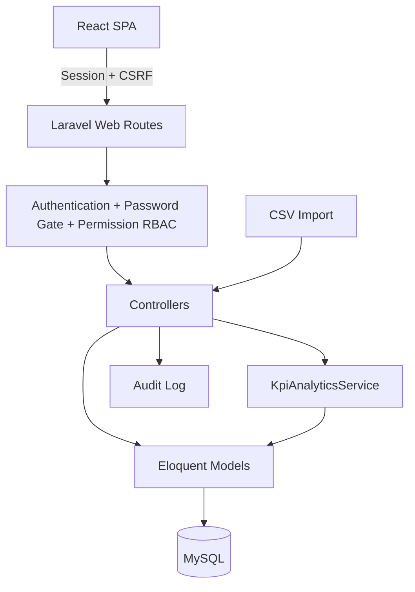
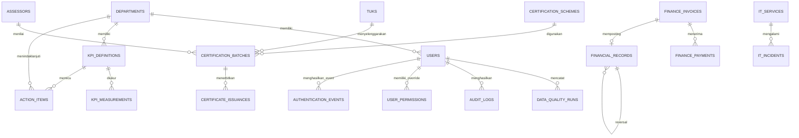
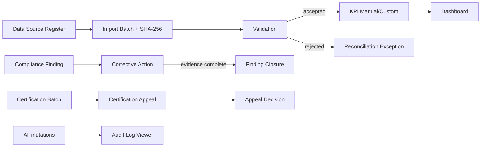
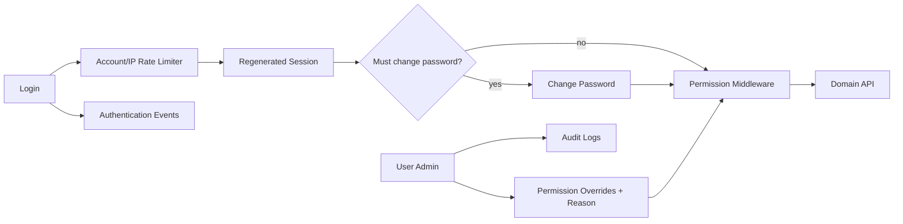
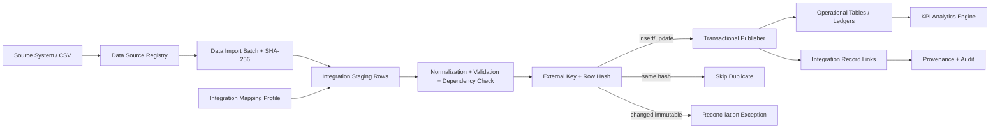
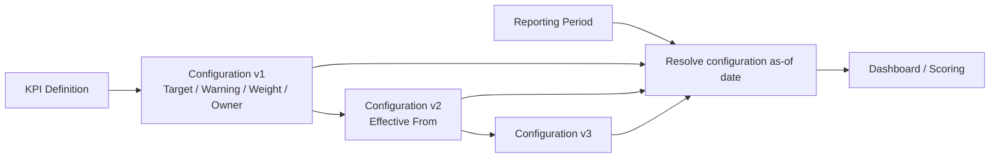
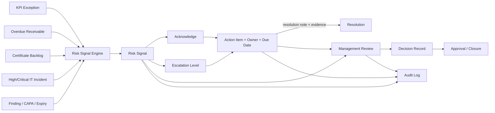

# Arsitektur NADI

NADI menggunakan Laravel sebagai API dan lapisan domain, React sebagai antarmuka, MySQL sebagai basis data produksi, serta Chart.js untuk visualisasi. Aplikasi lokal dapat menggunakan SQLite agar demonstrasi dan pengujian tidak mensyaratkan layanan MySQL yang aktif.





Direktori `app/Models` menyimpan entitas dan relasi. `app/Services/KpiAnalyticsService.php` menjadi satu sumber rumus agregasi agar controller dan UI tidak menduplikasi perhitungan. `app/Http/Controllers` memvalidasi input dan mengatur use case. `app/Http/Middleware` menerapkan module gate, forced-password gate, permission per aksi, serta response security headers. `database/migrations` adalah skema portabel MySQL/SQLite, sedangkan `database/seeders/PrototypeSeeder.php` hanya membuat data demonstrasi deterministik. React berada di `resources/js/app.jsx` dan sistem visual berada di `resources/css/custom.css`.

Hak akses menggunakan RBAC granular. Role bawaan adalah `director`, `department_head`, `analyst`, dan `viewer`; permission default diturunkan dari kombinasi role dan divisi, lalu dapat dioverride per pengguna melalui `user_permissions`. Permission membedakan hak baca dari tindakan operasional dan tindakan berisiko tinggi, misalnya `finance.invoices.manage`, `finance.reverse`, `certification.manage`, `certification.issue`, `governance.provenance.manage`, serta `users.manage`. Backend tetap menjadi sumber otorisasi; React hanya menyembunyikan kontrol yang tidak berizin untuk UX yang konsisten.

Semua route operasional berada di belakang `password.changed`, sehingga akun dengan password sementara hanya dapat mengakses identitas, logout, dan perubahan password. Login memakai rate limit per akun+IP dan per IP, authentication event disimpan untuk keberhasilan, kegagalan, throttling, akun nonaktif, logout, dan perubahan password. Reset password administratif memutus sesi lain. Sistem mencegah self-deactivation dan menjaga minimal satu director aktif. Security headers ditambahkan pada response, dan production menggunakan template `.env.production.example` dengan HTTPS cookie, encrypted database session, debug off, serta `VITE_DEMO_MODE=false`.

Skor KPI dihitung di server. UI hanya menerima hasil dan histori yang telah dihitung, lalu membentuk grafik dari array periode. Pendekatan ini menjaga konsistensi antara kartu, grafik, ekspor, dan endpoint integrasi. Setiap target historis menggunakan snapshot agar perubahan kebijakan tidak menulis ulang masa lalu.

Untuk domain sertifikasi, `CERT-VOLUME`, `CERT-PASS`, dan `CERT-SLA` menggunakan **operational ledger sebagai single source of truth**. `CERT-VOLUME` berasal dari jumlah asesi pada batch, `CERT-PASS` dari keputusan final kompeten/belum kompeten, dan `CERT-SLA` dari cohort jatuh tempo sertifikat dibanding event `certificate_issuances`. Ketiga KPI tersebut tidak dapat dioverride lewat input manual atau CSV. Kolom `certificates_issued` dan `issued_on_time` pada batch hanya menjadi cache operasional; event penerbitan tetap menjadi bukti utama dan cache dihitung ulang setelah koreksi keputusan/deadline.

Lifecycle batch berjalan berurutan `planned → document_review → assessment → decision → completed`. Untuk masuk tahap `decision`, hasil seluruh asesi dan timestamp selesai asesmen/keputusan wajib tersedia. Deadline sertifikat dihitung otomatis 30 hari setelah keputusan. Tahap `completed` hanya diizinkan setelah sertifikat seluruh peserta kompeten tercatat diterbitkan. Semua perubahan lifecycle dan penerbitan masuk `audit_logs`.

Untuk domain keuangan, `financial_records` adalah **immutable operational ledger**. Nilai bersih dihitung dari entry normal dikurangi entry reversal; transaksi asli tidak dihapus. Invoice berada di `finance_invoices` dan saat dibuat otomatis memposting satu revenue entry ke ledger. Pembayaran berada di `finance_payments` dan memengaruhi saldo piutang, bukan pengakuan revenue. Pembayaran dapat direversal dengan alasan audit. `financial_records.reversal_of_id` mempunyai invariant unik di database dan workflow reversal/void memakai row locking agar request paralel tidak dapat membuat double reversal atau meloloskan pembayaran baru ketika invoice sedang di-void. Invoice hanya dapat di-void setelah pembayaran aktif direversal, lalu sistem membuat revenue reversal yang terhubung ke posting awal.

`FIN-REV`, `FIN-MARGIN`, dan `FIN-BUDGET` dihitung otomatis per bulan dari ledger yang sama dengan dashboard Finance. `FIN-REV` menggunakan net revenue dalam juta rupiah, `FIN-MARGIN = (revenue - expense) / revenue`, dan `FIN-BUDGET = |expense - budget| / budget`. Ketiga KPI tersebut tidak dapat dioverride lewat pengukuran manual atau CSV. Sub-ledger invoice menghasilkan open receivable, overdue receivable, aging bucket, payment receipt, serta reconciliation antara invoice aktif dan posting revenue invoice sampai akhir periode.

Untuk domain TI, `it_incidents` dan `it_services` menjadi sumber reliabilitas. Downtime tidak dijumlahkan mentah: interval outage dipotong ke batas periode, dikelompokkan per layanan, lalu interval yang overlap digabung sebelum menghitung menit downtime. Uptime agregat menggunakan total service-minutes sebagai denominator. MTTR memakai cohort insiden yang `resolved_at`-nya berada pada bulan laporan dan menghitung durasi penuh mulai sampai selesai. Lifecycle operasional adalah `open → investigating → resolved`; penyelesaian menyimpan resolver, ringkasan resolusi, dan root cause opsional.

`data_quality_runs` menjadi evidence ledger untuk kualitas data. Setiap run menyimpan dataset, sistem sumber, timestamp audit, total/valid records, dan kategori temuan. `IT-DATA = Σ valid_records / Σ total_records × 100` sehingga agregasi lintas dataset berbobot volume rekam, bukan rata-rata persentase sederhana. `IT-UPTIME`, `IT-MTTR`, dan `IT-DATA` system-derived dan diblokir dari endpoint pengukuran manual maupun CSV.

Jalur adaptasi data nyata adalah sumber operasional menuju staging, validasi dan deduplikasi, pemetaan master, pemuatan transaksi, rekonsiliasi agregat, lalu publikasi dashboard. Integrasi sebaiknya idempoten dan menyimpan `source_system`, `source_id`, `import_batch_id`, serta hash payload pada fase produksi sehingga data dapat ditelusuri dan proses dapat diulang dengan aman.

## Governance, compliance, dan provenance

Iteration 5 menambahkan lapisan assurance agar aplikasi dapat dipakai sebagai alat keputusan, bukan hanya dashboard agregasi.

- `compliance_findings` menyimpan temuan audit/ketidaksesuaian, severity, pemilik, tenggat, dan bukti penutupan.
- `corrective_actions` adalah CAPA yang terikat langsung ke temuan. Temuan tidak dapat ditutup selama masih ada CAPA yang belum selesai; CAPA tidak dapat diselesaikan tanpa evidence.
- `certification_appeals` mengikat proses banding ke `certification_batches` dan menyimpan referensi pemohon yang privacy-safe, alasan, tenggat, status, keputusan, dan ringkasan resolusi.
- `compliance_obligations` menjadi register lisensi/kewajiban/validitas yang dapat dipantau bersama masa berlaku skema, TUK, dan asesor.
- `data_sources` memberi hierarchy/provenance sumber berdasarkan tipe dan `authority_rank`.
- setiap impor CSV menghasilkan `data_import_batches` dengan nama file, SHA-256, jumlah baris diterima/ditolak, status proses, errors, dan status rekonsiliasi.
- `kpi_measurements` manual/imported menyimpan `source_type`, `source_reference`, dan `data_import_batch_id`; KPI system-derived tetap bersumber dari ledger operasional dan tidak dapat dioverride.
- `audit_logs` ditampilkan pada halaman Governance agar perubahan lintas modul dapat diperiksa tanpa akses database langsung.

Akses Governance bersifat lintas fungsi untuk kepala divisi. Penambahan source register, obligation register, dan keputusan rekonsiliasi dibatasi ke Pimpinan atau fungsi Mutu & Kepatuhan. Banding dapat dikelola oleh Pimpinan, Mutu & Kepatuhan, atau Sertifikasi.




## Identity, RBAC, dan production security



Segregation of duties diterapkan pada aksi sensitif. Contoh: Finance analyst dapat membuat ledger/invoice/payment bila default permission mengizinkan, tetapi reversal memerlukan `finance.reverse`; Certification issuance memerlukan `certification.issue` terpisah dari `certification.manage`; provenance dan reconciliation membutuhkan `governance.provenance.manage`; administrasi akun membutuhkan `users.manage` dan hanya director yang dapat mengubah override permission.

Deployment production tidak bergantung pada seeder demo. Setelah `php artisan migrate --force`, akun administrator pertama dibuat melalui `php artisan nadi:create-admin`. Frontend tidak menyimpan literal email/password demo. Jika demo mode diaktifkan, halaman login mengambil daftar akun contoh dari `/api/demo-access`; endpoint tersebut mengembalikan `404` ketika server-side demo mode dimatikan. Password demo tidak memiliki fallback di source dan harus diberikan eksplisit lewat `NADI_DEMO_PASSWORD` pada environment prototype.

## Real Data Onboarding Layer



Idempotency tidak mengandalkan nama file. Identitas record adalah `data_source_id + dataset_type + external_key`, sedangkan `row_hash` menentukan apakah payload sama, berubah, atau baru. Dataset mutable dapat di-upsert secara terkendali; ledger immutable mewajibkan workflow domain seperti reversal/void sehingga import tidak dapat menghapus jejak transaksi.

Detail kontrak, urutan onboarding, dan checklist produksi terdapat pada `docs/INTEGRATION_ONBOARDING.md`.

## KPI Catalog dan configuration versioning

Target KPI tidak lagi diperlakukan sebagai satu nilai mutable. `kpi_definitions` menyimpan identitas indikator dan mode perhitungan, sedangkan `kpi_configurations` menyimpan versi kebijakan kinerja yang berlaku pada rentang waktu tertentu.



Konfigurasi baru tidak menimpa versi lama. Ketika versi baru dimulai, versi open-ended sebelumnya ditutup pada hari sebelum `effective_from` baru. Dashboard, status KPI, dan bobot skor kemudian menggunakan konfigurasi yang aktif pada `as_of` laporan. KPI manual menyimpan `target_snapshot` pada measurement sebagai evidence tambahan, sedangkan KPI system-derived membaca target/threshold/bobot langsung dari configuration version yang berlaku pada periode laporan.

`calculation_mode=system` digunakan untuk sembilan KPI operasional bawaan dan tidak dapat diubah melalui UI. KPI custom dibuat sebagai `manual` dan dapat menerima measurement manual/CSV selama indikator aktif pada periode tersebut. Metadata identitas seperti kode dan arah indikator diperlakukan sebagai kontrak stabil; perubahan target dilakukan melalui versi konfigurasi, bukan edit-in-place.

## Master-data lifecycle

Master skema, TUK, asesor, dan layanan IT menggunakan lifecycle non-destructive. Archive menyimpan timestamp, user, dan alasan serta menonaktifkan record untuk proses baru, tetapi foreign key historis tetap tersedia untuk laporan dan audit. Restore mengaktifkan record kembali tanpa membuat identitas baru.

Dependency guard mencegah archive ketika record masih dibutuhkan proses aktif: skema/TUK/asesor dengan batch belum selesai atau layanan IT dengan insiden unresolved. Form operasional dan validation layer tidak menawarkan/menerima master yang sudah diarsipkan. Seluruh update, archive, dan restore menyimpan before/after state pada `audit_logs`.

Layanan IT memiliki `monitoring_started_at` sebagai batas eksplisit kapan SLA availability mulai dihitung. Engine uptime memotong denominator dan downtime ke jendela `monitoring_started_at → archived_at/report_end`, sehingga onboarding layanan historis tidak menganggap NADI telah memantau layanan sejak awal periode secara fiktif.

## Decision workflow, risk signals, dan management review

Exception operasional tidak lagi berhenti sebagai badge pada dashboard. `RiskSignalService` menyinkronkan kondisi lintas domain menjadi record `risk_signals` yang idempotent menggunakan fingerprint per sumber/rule. Refresh berulang tidak membuat duplikasi; ketika kondisi sumber pulih, signal aktif ditutup otomatis dengan alasan system-generated.



Signal mempunyai severity, department ownership, sumber/reference, due time, acknowledgement, escalation level, dan resolution metadata. Signal yang di-resolve manual tetapi kondisi sumber masih memenuhi rule akan terbuka kembali pada sinkronisasi berikutnya, sehingga closure tidak dapat menyembunyikan risiko operasional yang belum benar-benar selesai.

`action_items` sekarang dapat ditautkan langsung ke signal dan menyimpan acknowledgement, escalation, decision reference, serta resolution note/evidence. Status `completed` bersifat terminal dan memerlukan evidence. Eskalasi signal juga memperbarui metadata action aktif yang tertaut sehingga alert dan execution board tidak berbeda level.

`management_reviews` dan `management_review_items` menyimpan agenda dari signal, owner, due date, keputusan per item, summary rapat, keputusan akhir, approver, serta lifecycle `draft → in_review → approved → closed`. Lifecycle tidak dapat dimundurkan; approval membutuhkan keputusan tertulis dan item terkunci setelah review disetujui.

## Scheduled monitoring and notification delivery

```text
Operational ledgers / KPI / compliance / IT
                ↓
         RiskSignalService
                ↓
     nadi:monitor-risks (scheduler)
        ├─ auto escalation
        ├─ overdue action reminder
        ├─ management review reminder
        └─ user_notifications
                ↓
      SSE /api/notifications/stream
                ↓
        Notification Center UI
                ↓
          Pusat Keputusan
```

`user_notifications` adalah inbox delivery/user attention layer, bukan source of truth keputusan. `risk_signals`, `action_items`, `management_reviews`, dan `audit_logs` tetap menjadi evidence operasional. Acknowledgement notification tidak mengubah acknowledgement signal.

## Immutable reporting and evidence snapshots

```text
Operational ledgers + KPI configuration + governance + decisions
                            ↓
                     ReportingService
                            ↓
                    report_snapshots
                ┌───────────┼───────────┐
                ↓           ↓           ↓
          Printable HTML   JSON/CSV   Evidence ZIP
                ↓                       ↓
          Print / PDF             manifest + tables
```

`report_snapshots` freezes the report payload, KPI configuration used for the period, source/import provenance, generator, period, and SHA-256 checksum. Download/print endpoints render only the stored snapshot and do not query live operational values again. This preserves evidence integrity when operational data or KPI targets change after a management meeting.

Snapshot historis juga menggunakan semantics **as-of report end**. Backlog sertifikat hanya memperhitungkan issuance sampai akhir periode; pembayaran yang baru direversal setelah akhir periode tetap dianggap aktif pada snapshot lama; risk signal/action memakai `status_as_of`; finding/CAPA/appeal Governance memakai status penutupan/penyelesaian/keputusan yang berlaku pada akhir periode. Dengan demikian evidence lama tidak ditulis ulang oleh kejadian masa depan.

## Release readiness dan deployment boundary

NADI memisahkan **liveness** dari **readiness**:

```text
/up
  └─ proses Laravel hidup

/api/health/ready
  └─ PHP/runtime prerequisites
  └─ application key
  └─ writable runtime directories
  └─ production-safe configuration
  └─ frontend build manifest/assets
  └─ database connectivity + migration state
```

Readiness route tidak memakai session state sehingga dependency failure dapat dilaporkan sebagai HTTP `503` sebelum request operasional menerima traffic. Production ingress/load balancer sebaiknya menggunakan readiness endpoint untuk keputusan menerima traffic dan `/up` untuk liveness/restart semantics.

Release pipeline yang diharapkan:

```text
scripts/final-gate.sh
   ↓
execution-readiness doctor + runtime preflight
   ↓
clean Composer + npm installs → real Vite build
   ↓
actual MySQL 8 + guarded migrate:fresh
   ↓
PHPUnit-on-MySQL + Pint
   ↓
production readiness + cache verification
   ↓
HTTP + browser acceptance
   ↓
source-bound acceptance evidence verification
   ↓
deterministic double packaging
   ↓
extracted closed-world verification + SHA-256 evidence
```

Repository menyediakan `.github/workflows/release-gates.yml` sebagai reproducible CI baseline menggunakan MySQL nyata dan menjalankan **script authoritative yang sama**, `scripts/final-gate.sh`. `scripts/verify-release.sh` dan macOS `--release-gate` hanya wrapper sehingga local/CI tidak mempunyai implementasi gate yang berbeda. `scripts/package_release.py` hanya mengemas source + compiled frontend yang diperlukan runtime; generated dependency/cache, environment secrets, database demo, log, acceptance evidence, serta tooling AI/development dikeluarkan. `RELEASE_MANIFEST.json` membekukan daftar file dan SHA-256 setiap entry untuk pemeriksaan artifact.
