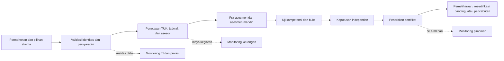

# Analisis LSP Migas dan Rancangan Sistem KPI Terintegrasi

## Ringkasan eksekutif

LSP Migas adalah LSP pihak ketiga berlisensi aktif BNSP dengan nomor BNSP-LSP-074-ID. Direktori BNSP yang diakses pada September 2026 mencatat masa berlaku lisensi sampai 4 Mei 2031, 130 skema, 40 TUK, dan 117 asesor. Situs LSP Migas sendiri menyampaikan posisi sebagai lembaga sertifikasi profesi migas yang mendorong kompetensi pekerja industri menuju persaingan global serta menampilkan 30.000+ peserta asesi, 133+ skema, dan 48 kerja sama TUK.^1,2

Perbedaan angka pada dua kanal resmi bukan alasan memilih salah satu angka secara diam-diam. Perbedaan itu justru menunjukkan kebutuhan bisnis penting: setiap KPI harus memiliki definisi, pemilik, sumber, periode berlaku, waktu pembaruan, dan status rekonsiliasi. Sistem NADI karena itu memisahkan angka operasional dari angka publik dan menandai seluruh data awal sebagai data sintetis.

Situs publik menunjukkan tiga kelompok aktivitas yang paling relevan bagi alat keputusan: pengelolaan skema yang luas, jejaring TUK lintas kota, dan penerbitan daftar sertifikat tahunan. Portal sertifikasi juga merekam pemilihan skema, data pribadi, pendidikan dan pekerjaan, tujuan sertifikasi atau sertifikasi ulang, TUK, jadwal, bukti kompetensi, serta asesmen mandiri FR-APL-02.^3,4,5 Sistem KPI yang tepat bukan pengganti portal tersebut; ia merupakan lapisan manajerial yang menggabungkan keluaran proses sertifikasi, finansial, dan reliabilitas TI.

## Temuan faktual

| Area | Temuan terverifikasi | Implikasi sistem |
|---|---|---|
| Legalitas | LSP pihak ketiga; lisensi BNSP-LSP-074-ID aktif sampai 4 Mei 2031.^2 | Masa berlaku lisensi, status surveilans, temuan audit, dan penyelesaian tindak lanjut harus menjadi indikator pimpinan. |
| Skala layanan | Situs LSP menyebut 30.000+ peserta, 133+ skema, dan 48 kerja sama TUK; BNSP mencatat 130 skema, 40 TUK, dan 117 asesor.^1,2 | Diperlukan master data, rekonsiliasi antarsumber, serta histori perubahan agar angka tidak kehilangan konteks. |
| Portofolio | Lingkup publik mencakup K3, produksi, pengeboran, pengelasan, inspeksi, kalibrasi, seismik, boiler, scaffolding, kelistrikan, SPBU/SPPLPG, dan bidang lain.^4 | Analisis volume dan kualitas harus dapat dipecah menurut skema, rumpun, TUK, wilayah, asesor, dan pelanggan. |
| Jejaring TUK | Halaman TUK menampilkan mitra di Jakarta, Batam, Cilegon, Surakarta, Semarang, Balikpapan, Lhokseumawe, dan lokasi lain.^5 | Kapasitas, utilisasi, sebaran geografis, kelengkapan sarana, dan masa berlaku verifikasi TUK perlu dipantau. |
| Alur sertifikasi | Situs menyebut kelengkapan dokumen, pra-asesmen, asesmen, sidang praktik, pengumuman, lalu penerbitan sertifikat. Target publik penerbitan adalah 30 hari setelah seluruh proses selesai.^1 | Lead time per tahap dan SLA 30 hari harus dihitung dari cap waktu, bukan input persentase manual. |
| Bukti kompetensi | Portal meminta identitas, ijazah/transkrip, surat keaslian, contoh pekerjaan, sertifikat pelatihan, referensi, job description, pengalaman, CV, dan sertifikat kompetensi sebelumnya.^3 | Kualitas dan kelengkapan data adalah KPI operasional sekaligus risiko privasi; dashboard cukup memakai agregat dan tidak perlu menampilkan dokumen pribadi. |
| Jejak sertifikat | Situs menyediakan daftar penerima sertifikat per tahun dengan TUK, skema, nomor registrasi, nomor sertifikat, dan masa berlaku.^6 | Data dapat mendukung volume penerbitan dan tren skema, tetapi pemrosesan ulang identitas harus memiliki dasar dan pembatasan akses. |

## Interpretasi organisasi

Situs resmi tidak menerbitkan bagan organisasi rinci yang membuktikan nama dan batas setiap divisi. Pembagian Pimpinan, Sertifikasi, Keuangan, dan Teknologi Informasi dalam prototipe adalah model kerja untuk kebutuhan pengambilan keputusan, bukan klaim bahwa struktur formal LSP Migas persis demikian.

Pimpinan menerima pandangan lintas fungsi, mengevaluasi lisensi, mutu layanan, risiko, dan tindak lanjut. Fungsi Sertifikasi mengelola permohonan, skema, TUK, asesor, batch, keputusan, dan penerbitan. Fungsi Keuangan menghubungkan volume layanan dengan pendapatan, beban, margin, anggaran, dan piutang. Fungsi TI memastikan portal, database, integrasi dokumen, dan jaringan tersedia serta dapat diaudit.

Pedoman sistem informasi BNSP membagi Sistem Informasi Sertifikasi Terpadu LSP ke domain sertifikasi, manajemen, dan administrasi; modulnya mencakup perencanaan, aplikasi/permohonan, asesmen, pelaporan, portal, administrasi umum, SDM, skema sertifikasi, serta manajemen pengetahuan.^7 Pembagian modul NADI kompatibel dengan konsep tersebut tanpa mengklaim menggantikan sistem sertifikasi BNSP.

## Model proses yang dipantau

Titik ukur harus diturunkan dari kejadian proses: kapan dokumen lengkap, kapan asesmen dimulai, kapan keputusan dibuat, kapan sertifikat diterbitkan, berapa asesi yang kompeten, sumber daya apa yang digunakan, dan berapa biaya yang timbul. Dengan model ini, grafik dapat dihitung ulang dan diaudit.

## Kamus KPI yang direkomendasikan

| KPI | Rumus | Pemilik | Keputusan yang didukung |
|---|---|---|---|
| Volume asesi | jumlah peserta unik dengan asesmen pada periode | Sertifikasi | kebutuhan jadwal, asesor, dan TUK |
| Tingkat kompeten | keputusan kompeten / seluruh keputusan final × 100% | Sertifikasi | mutu persiapan, konsistensi skema, evaluasi pola kegagalan |
| SLA penerbitan | sertifikat terbit ≤30 hari / seluruh sertifikat yang wajib terbit × 100% | Sertifikasi | prioritas backlog dan perbaikan proses |
| Lead time dokumen | rata-rata waktu dokumen masuk sampai dinyatakan lengkap | Sertifikasi | penyederhanaan persyaratan dan komunikasi asesi |
| Utilisasi TUK | seat asesi terpakai / kapasitas tersedia × 100% | Sertifikasi | distribusi batch dan evaluasi mitra |
| Beban asesor | total asesi atau hari asesmen per asesor | Sertifikasi | pemerataan tugas dan kebutuhan penambahan asesor |
| Pendapatan sertifikasi | total jurnal pendapatan jasa pada periode | Keuangan | pencapaian rencana dan tren permintaan |
| Margin operasional | (pendapatan − beban) / pendapatan × 100% | Keuangan | harga, biaya kegiatan, dan efisiensi TUK |
| Deviasi anggaran | nilai absolut realisasi − anggaran / anggaran × 100% | Keuangan | pengendalian biaya dan revisi forecast |
| Biaya per asesi | biaya langsung batch / peserta batch | Keuangan | perbandingan efisiensi skema dan TUK |
| Uptime layanan | (waktu tersedia − downtime) / waktu tersedia × 100% | TI | investasi reliabilitas dan prioritas layanan |
| MTTR | total durasi penyelesaian insiden / insiden selesai | TI | kapasitas respons dan perbaikan runbook |
| Kelengkapan data | record wajib lolos validasi / record diperiksa × 100% | TI dan Sertifikasi | perbaikan input, integrasi, dan rekonsiliasi |
| Tindak lanjut tepat waktu | tindakan selesai sebelum tenggat / tindakan selesai × 100% | Pimpinan | akuntabilitas rapat dan efektivitas keputusan |

Skor gabungan prototipe menggunakan rata-rata pencapaian berbobot. Untuk indikator “semakin tinggi semakin baik”, skor adalah aktual ÷ target × 100. Untuk indikator “semakin rendah semakin baik”, skor adalah target ÷ aktual × 100. Nilai dibatasi 120 agar satu indikator yang sangat melampaui target tidak menutupi indikator kritis lain. Skor minimal 100 berstatus sesuai target, 90–99,9 perlu dipantau, dan di bawah 90 memerlukan tindakan. Ambang tersebut adalah konfigurasi prototipe dan harus disahkan pemilik proses sebelum produksi.

## Desain data dan mutu informasi

Setiap angka operasional membutuhkan dimensi waktu, definisi, unit, arah, target, bobot, pemilik, dan sumber. Nilai target disalin ke pengukuran sebagai `target_snapshot` sehingga perubahan target bulan depan tidak mengubah penilaian historis. Data sertifikasi disimpan per batch dan terhubung ke skema, TUK, dan asesor. Data keuangan menggunakan referensi transaksi unik. Insiden TI memiliki waktu mulai dan selesai agar uptime dan MTTR benar-benar dihitung.

Rekonsiliasi harus membedakan sedikitnya empat lapisan: master internal, transaksi internal, agregat dashboard, dan publikasi eksternal. Selisih 133 versus 130 skema atau 48 versus 40 TUK perlu dicatat dengan alasan yang mungkin berbeda—misalnya waktu pembaruan, status aktif, atau cakupan definisi—tanpa menyimpulkan sebab sebelum data internal tersedia.

Kontrol kualitas yang disarankan mencakup kunci unik, validasi jumlah `passed + failed + pending = total_assesi`, tanggal keputusan yang tidak mendahului asesmen, sertifikat hanya untuk keputusan kompeten, transaksi keuangan seimbang dengan buku besar, dan insiden selesai yang wajib memiliki `resolved_at`. Import CSV prototipe memvalidasi header, kode KPI, nilai numerik, serta kewenangan pengguna.

## Privasi, keamanan, dan auditabilitas

Portal sertifikasi memproses identitas dan dokumen pendukung yang termasuk data pribadi. UU 27/2022 mengatur dasar pemrosesan, hak subjek, kewajiban pengendali/prosesor, keamanan, dan penghapusan; uji materi 2024 juga memengaruhi pembacaan Pasal 53 mengenai fungsi pelindungan data.^8 PP 71/2019 mewajibkan tata kelola sistem yang baik, rekam jejak audit, pengamanan komponen, serta penjagaan kerahasiaan, keutuhan, keautentikan, ketersediaan, dan keterlacakan informasi elektronik.^9

Implikasi produksinya adalah akses berbasis peran, prinsip hak minimum, enkripsi saat transit dan tersimpan, audit log yang tidak dapat diedit pengguna biasa, retensi dokumen, prosedur koreksi/penghapusan sesuai dasar hukum, backup teruji, pemisahan data demonstrasi dan produksi, serta larangan menampilkan identitas asesi di dashboard eksekutif tanpa kebutuhan yang sah. Prototipe sengaja tidak menyalin nama atau nomor sertifikat dari daftar publik.

## Batas prototipe dan kesiapan data nyata

Data demonstrasi menggunakan pola sintetis 12 bulan dan hanya mengambil struktur proses serta kategori layanan dari sumber publik. Nilainya dirancang konsisten untuk menguji rumus, filter, otorisasi, grafik, impor, dan perubahan status. Nilai tersebut tidak boleh dipresentasikan sebagai performa nyata LSP Migas.

Adaptasi menuju data perusahaan dilakukan dengan mengganti seeder melalui konektor import atau ETL tanpa mengubah komponen visual. Tabel pemetaan minimum mencakup sumber asli, tabel tujuan, kolom kunci, aturan transformasi, frekuensi, pemilik, pemeriksaan kualitas, dan kebijakan data pribadi. Tahap penerapan yang aman adalah profiling sampel anonim, pemetaan dan rekonsiliasi, paralel-run dengan laporan lama, persetujuan pemilik KPI, lalu cutover bertahap.

## Sumber

1. LSP Migas. “[LSP MIGAS — Let’s Do Competent](https://www.lsp-migas.org/).” Diakses September 2026.
2. BNSP. “[Minyak dan Gas (MIGAS) — Profil LSP](https://bnsp.go.id/lsp/minyak-dan-gas-migas).” Diakses September 2026.
3. LSP Migas. “[Uji Kompetensi Online](https://sertifikasi.lsp-migas.org/welcome/ujikompetensi).” Diakses September 2026.
4. LSP Migas. “[Lingkup Skema LSP Migas](https://www.lsp-migas.org/?page_id=120).” Diakses September 2026.
5. LSP Migas. “[Daftar Tempat Uji Kompetensi](https://www.lsp-migas.org/?page_id=116).” Diakses September 2026.
6. LSP Migas. “[Sertifikat LSP Migas 2026](https://www.lsp-migas.org/?page_id=299).” Diakses September 2026.
7. BNSP. “[Pedoman Manajemen Sistem Informasi Sertifikasi LSP dan BNSP](https://sisfo.bnsp.go.id/download/nGToJRAbBK7ViNWpm4eSX5cOfj8UQ2t6.pdf).” 2013. Daftar pedoman BNSP terkini juga memuat pembaruan pedoman kelembagaan, TUK, lisensi, skema, dan pelaporan yang dipublikasikan 14 Mei 2026 pada [portal informasi publik BNSP](https://bnsp.go.id/informasi-publik?category=Pedoman+dan+Peraturan&sort=oldest).
8. Pemerintah Republik Indonesia. “[Undang-Undang Nomor 27 Tahun 2022 tentang Pelindungan Data Pribadi](https://peraturan.bpk.go.id/Details/229798/uuno-27-tahun-2022).” 17 Oktober 2022.
9. Pemerintah Republik Indonesia. “[Peraturan Pemerintah Nomor 71 Tahun 2019 tentang Penyelenggaraan Sistem dan Transaksi Elektronik](https://jdih.komdigi.go.id/produk_hukum/view/id/695/t/peraturan%2Bpemerinta).” 2019.
